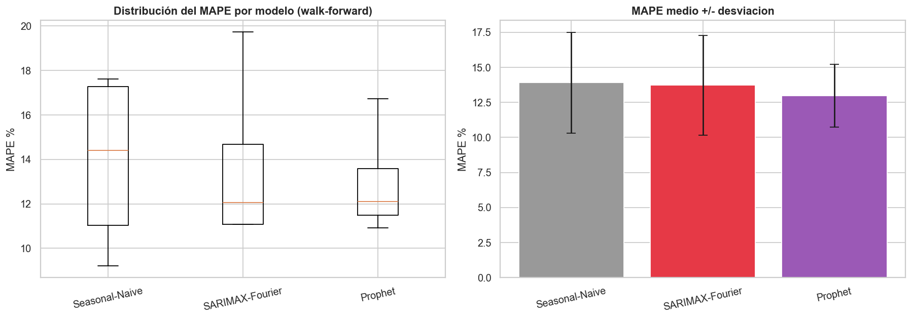
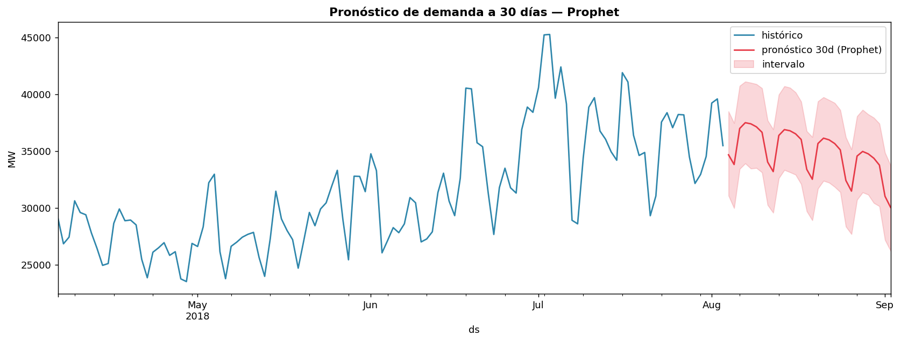

# Time Series Forecasting — Demanda Eléctrica (PJM)

> **Forecasting horario de demanda eléctrica: baseline, SARIMAX-Fourier y Prophet**
> *EDA temporal, descomposición y modelado con comparación honesta contra un baseline*

[](https://python.org)
[](https://www.statsmodels.org)
[](https://facebook.github.io/prophet/)

---

## Objetivo

Modelar y pronosticar la demanda eléctrica de **PJM East (PJME)** — **145,366 horas de
2002 a 2018** (~16.6 años) — caracterizando su estacionalidad y comparando modelos contra un
baseline honesto.

---

## Resultados (forecasting horario, test: 14 días = 336 h)

| Modelo | MAE (MW) | RMSE (MW) | MAPE |
|---|---|---|---|
| Seasonal-Naive (baseline) | 3,277 | 4,245 | 9.2 % |
| SARIMAX + Fourier | 4,286 | 5,331 | 11.1 % |
| Prophet | 3,532 | 4,238 | 10.9 % |

> **Lectura honesta:** en horario, el **naive semanal** (copiar la semana anterior) es un baseline
> durísimo a corto plazo. Prophet queda **a la par** (mejor RMSE) y **SARIMAX+Fourier ya es
> competitivo** (~11%), muy lejos del 21% del v1.0.0 — antes a SARIMA le faltaba la estacionalidad
> anual; con términos de Fourier la captura. Una sola ventana es ruidosa: el **backtesting
> walk-forward** da la comparación robusta.

---

## Backtesting walk-forward

Una sola ventana engaña: en el test de 14 días el naive parecía el mejor. Repitiendo la
evaluación en **4 ventanas** consecutivas y promediando, el ranking se ordena bien:

| Modelo | MAPE medio | desviación |
|---|---|---|
| Seasonal-Naive | 13.9 % | 3.6 |
| SARIMAX + Fourier | 13.7 % | 3.6 |
| **Prophet** | **13.0 %** | **2.3** |



**Prophet gana de forma robusta**: el MAPE medio más bajo y, sobre todo, la **menor varianza**
(más consistente entre ventanas). Por eso es el modelo que se sirve. Moraleja: un único split
puede señalar al modelo equivocado — por eso backtesteamos.

---

## Metodología

1. **EDA temporal** (`01_EDA.ipynb`) — serie completa, estacionalidad (hora/día/mes), tendencia, ADF.
2. **Descomposición** (`02_decomposition.ipynb`) — STL (tendencia+estacional+residuo), ADF +
   diferenciación, ACF/PACF, **split cronológico** (nunca aleatorio).
3. **Modelado horario** (`03_modeling.ipynb`) — **baseline naive-semanal**, **SARIMAX + Fourier**
   (estacionalidad múltiple como regresores) y **Prophet**; comparación MAE/RMSE/MAPE y
   **pronóstico a 30 días** (720 h). El pipeline reproducible: `python -m src.pipeline`.
4. **Backtesting walk-forward** (`04_backtesting.ipynb`) — evaluación en varias ventanas
   (media ± desviación) para un ranking robusto.

> La Fase 4 (LSTM) del roadmap es opcional y se omite: baseline + SARIMAX + Prophet ya constituyen
> un pipeline de forecasting sólido y reproducible.

---

## Estacionalidad y pronóstico

La demanda tiene **triple estacionalidad**: diaria (pico de tarde), semanal (menor en fin de
semana) y anual (picos de verano e invierno por climatización).



---

## Servir el pronóstico

El modelo Prophet entrenado se persiste (`src/forecast_model.json`); el CLI y la API lo cargan y
proyectan a futuro sin reentrenar.

```bash
python -m src.forecast --days 30        # CLI: pronóstico horario de 30 días
uvicorn src.api:app --reload            # API: GET /forecast?days=N  (docs en /docs)
```

---

## Estructura

```
time-series-forecasting/
├── config.yaml                   # serie, ventana, horizonte, Fourier, orden SARIMAX
├── data/                         # CSVs PJM (no versionado)
├── src/                          # data, features (Fourier), models, pipeline
│   └── forecast_model.json       # modelo Prophet persistido (lo carga la API)
├── notebooks/                    # 01_EDA, 02_decomposition, 03_modeling, 04_backtesting (importan src/)
├── reports/                      # figuras + metrics.json + backtest_metrics.json + experiments.csv
├── HALLAZGOS.md   README.md   ROADMAP.md
```

---

## Cómo ejecutar

```bash
pip install -r requirements.txt

# Pipeline completo de una vez (serie -> baseline + SARIMAX + Prophet -> métricas + modelo)
python -m src.pipeline

# O los notebooks (narrativa) en orden
jupyter nbconvert --to notebook --execute --inplace notebooks/01_EDA.ipynb
jupyter nbconvert --to notebook --execute --inplace notebooks/02_decomposition.ipynb
jupyter nbconvert --to notebook --execute --inplace notebooks/03_modeling.ipynb
```

> Dataset: [Hourly Energy Consumption — Kaggle](https://www.kaggle.com/datasets/robikscube/hourly-energy-consumption)
> (serie `PJME_hourly.csv`; no se versiona). En Windows, Prophet requiere `pip install prophet`.

> Detalle de detecciones y aprendizajes en [`HALLAZGOS.md`](HALLAZGOS.md).

---

## Autor

**Omar Mora Flores** · Data Analyst & ML Engineer
 omar13mor@gmail.com · [linkedin.com/in/omar-mora-flores](https://linkedin.com/in/omar-mora-flores)
